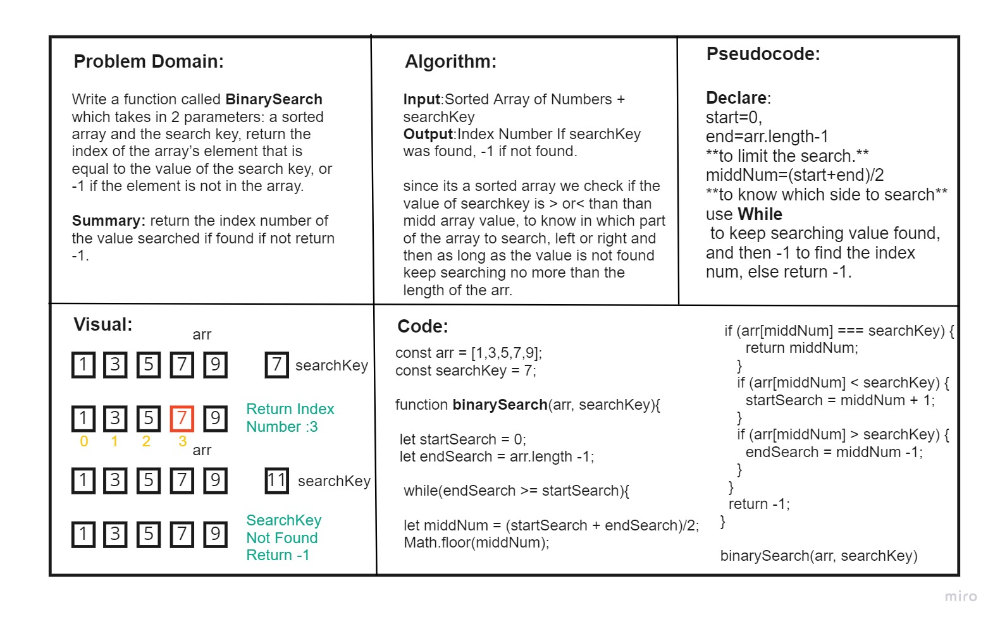

# Array Binary Search
<!-- Description of the challenge -->
Write a function called **BinarySearch** which takes in 2 parameters: a sorted array and the search key. Without utilizing any of the built-in methods available to your language, return the index of the array’s element that is equal to the value of the search key, or -1 if the element is not in the array.

Summary: return the index number of the value searched if found if not return -1.

## Whiteboard Process

## Approach & Efficiency
It took me Around 2 Hours to first analyze the problem and explain it properly in the whiteboard requirements and then run the actual code and check if works, as before trying to run it the logic may be right but the execution might have to be manipulated to work properly and as required.