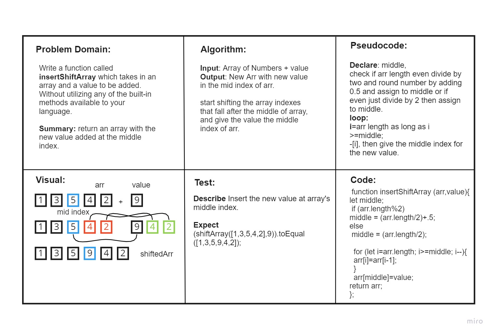

# Insert and shift in an array
<!-- Description of the challenge -->
Write a function called insertShiftArray which takes in an array and a value to be added. Without utilizing any of the built-in methods available to your language. 

Summary: return an array with the new value added at the middle index.

## Whiteboard Process

## Approach & Efficiency
It took me Around 2.5 Hours to first analyze the problem and explain it properly in the whiteboard requirements and then run the actual code and check if works, as before trying to run it the logic may be right but the execution might have to be manipulated to work properly and as required.