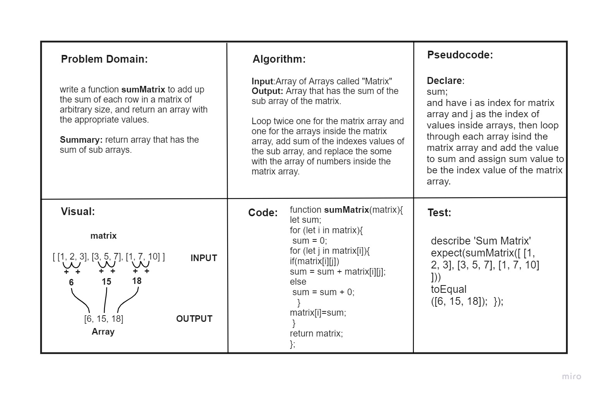

# Array matrix sum
<!-- Description of the challenge -->
write a function **sumMatrix** to add up the sum of each row in a matrix of arbitrary size, and return an array with the appropriate values.

**Summary**: return array that has the sum of sub arrays.

## Whiteboard Process

## Approach & Efficiency
It took me Around 50 mins to first analyze the problem and explain it properly in the whiteboard requirements and then run the actual code and check if works, as before trying to run it the logic may be right but the execution might have to be manipulated to work properly and as required.
and then around 15 mins for the mockup interview.