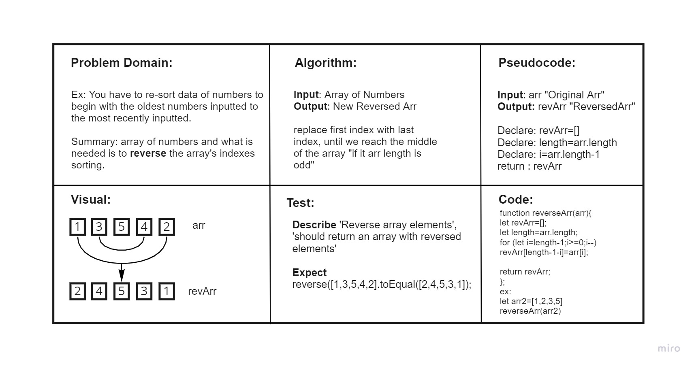

# Reverse an Array
<!-- Description of the challenge -->
Ex: You have to re-sort data of numbers to begin with the oldest numbers inputted to the most recently inputted.

Summary: array of numbers and what is needed is to reverse the array's indexes sorting.

## Whiteboard Process

## Approach & Efficiency
It took me Around 4 Hours because it took me long to understand the nature of the tasks since it's the first time we have such an assignment.