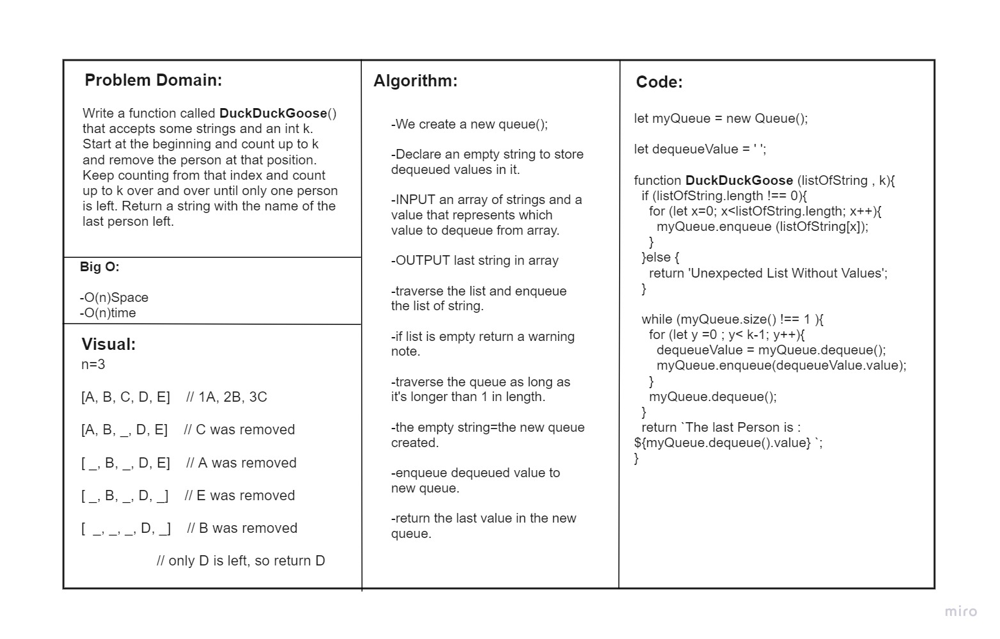
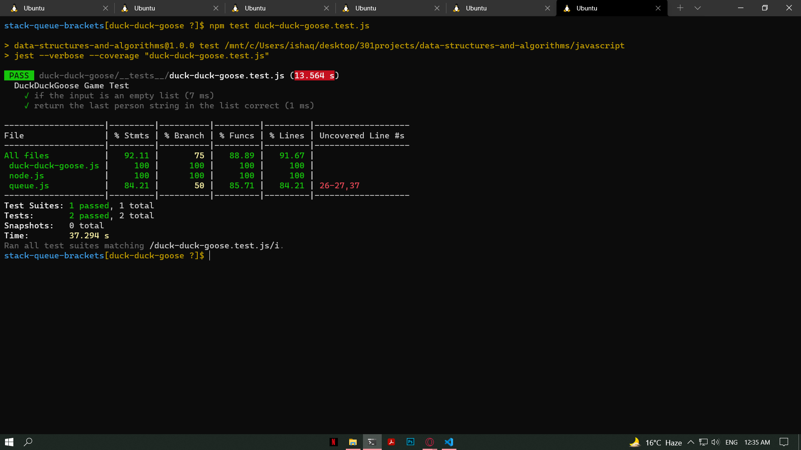

# Stack and Queue brackets

## Challenge
<!-- Short summary or background information -->
Write a function called **DuckDuckGoose**() that accepts some strings and an int k. Start at the beginning and count up to k and remove the person at that position. Keep counting from that index and count up to k over and over until only one person is left. Return a string with the name of the last person left.

n=3

A, B, C, D, E  // 1: A; 2: B; 3: C

A, B, D, E     // C was removed

B, D, E        // A was removed

B, D           // E was removed

D              // B was removed

               // only D is left
            

### Node
Create a Node class that has properties for the value stored in the Node, and a pointer to the next node.

### Queue
Create a Queue class that has a front property. It creates an empty Queue when instantiated.
This object should be aware of a default empty value assigned to front when the queue is created.
The class should contain the following methods:

**enqueue**
Arguments: value
adds a new node with that value to the back of the queue with an O(1) Time performance.

**dequeue**
Arguments: none
Returns: the value from node from the front of the queue
Removes the node from the front of the queue
Should raise exception when called on empty queue

**peek**
Arguments: none
Returns: Value of the node located at the front of the queue
Should raise exception when called on empty stack
is empty
Arguments: none
Returns: Boolean indicating whether or not the queue is empty

## Approach & Efficiency
<!-- What approach did you take? Why? What is the Big O space/time for this approach? -->

* ### Analyzed the problem
* ### Thought about the algorithm 
* ### Wrote the coding depending on today's demo
* ### I created the node test as well as LinkedList test

## API
<!-- Description of each method publicly available to your Linked List -->
**push**
adds a new node with that value to the top of the stack with an O(1) Time performance.

**pop**
Removes the node from the top of the stack

**peek**
Value of the node located at the top of the stack

**enqueue**
adds a new node with that value to the back of the queue with an O(1) Time performance.

**dequeue**
Removes the node from the front of the queue

**peek**
Returns: Value of the node located at the front of the queue

## Test
### npm run test 

