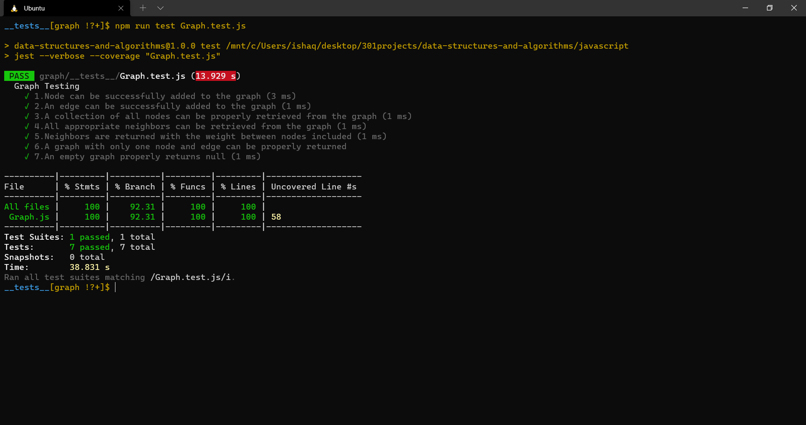
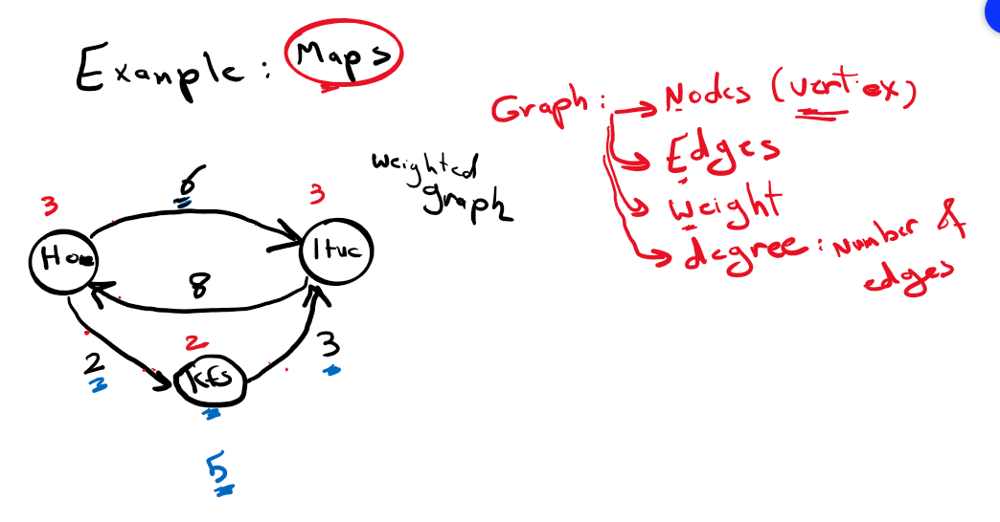
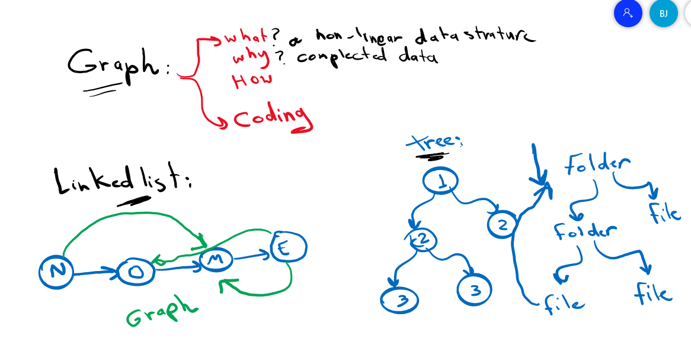
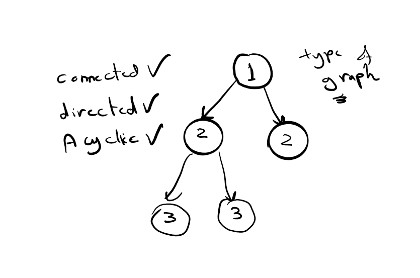

# Implementation: Graphs

## Challenge Setup & Execution
## Branch Name: **graph**

### Features
Implement your own Graph. The graph should be represented as an adjacency list, and should include the following methods:

### **add node**
Arguments: value
Returns: The added node
Add a node to the graph

### **add edge**
Arguments: 2 nodes to be connected by the edge, weight (optional)
Returns: nothing
Adds a new edge between two nodes in the graph
If specified, assign a weight to the edge
Both nodes should already be in the Graph

### **get nodes**
Arguments: none
Returns all of the nodes in the graph as a collection (set, list, or similar)

### **get neighbors**
Arguments: node
Returns a collection of edges connected to the given node
Include the weight of the connection in the returned collection

### **size**
Arguments: none
Returns the total number of nodes in the graph

## Structure and Testing

Utilize the Single-responsibility principle: any methods you write should be clean, reusable, abstract component parts to the whole challenge. You will be given feedback and marked down if you attempt to define a large, complex algorithm in one function definition.

### Write tests to prove the following functionality:

- Node can be successfully added to the graph
- An edge can be successfully added to the graph
- A collection of all nodes can be properly retrieved from the graph
- All appropriate neighbors can be retrieved from the graph
- Neighbors are returned with the weight between nodes included
- The proper size is returned, representing the number of nodes in the graph
- A graph with only one node and edge can be properly returned
- An empty graph properly returns null

### Lecture's WhiteBoard.

