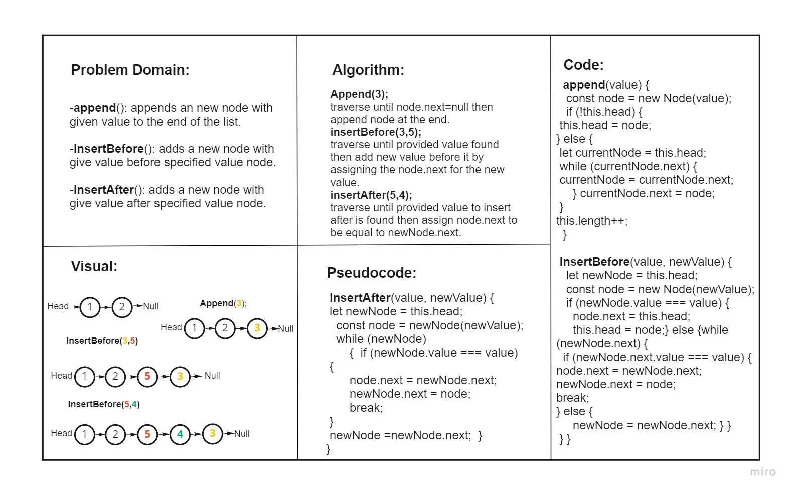
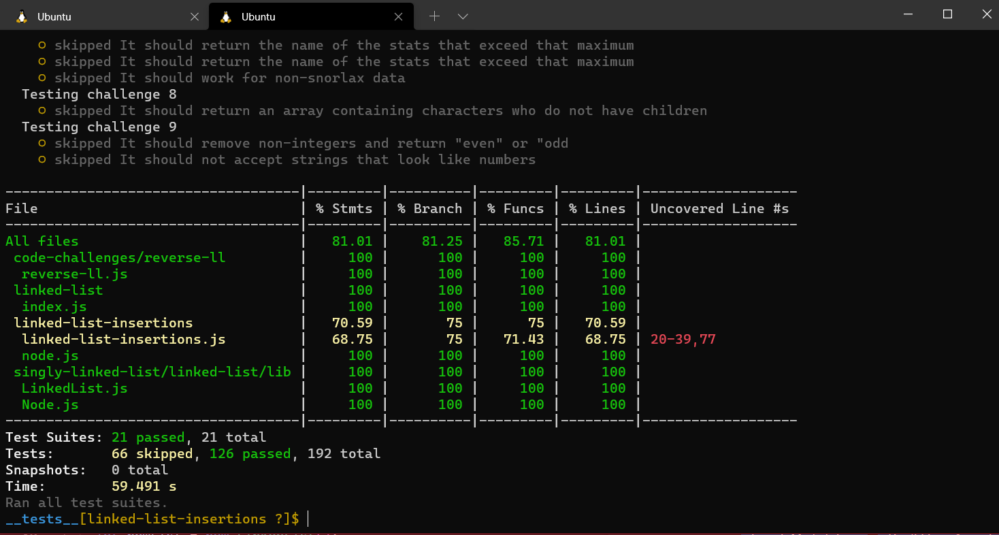

# Linked List Insertions
<!-- Short summary or background information -->
A Linked List is a sequence of Nodes that are connected/linked to each other. The most defining feature of a Linked List is that each Node references the next Node in the link.
## Challenge
<!-- Description of the challenge -->
Write the following methods for the Linked List class:

### append

arguments: new value
adds a new node with the given value to the end of the list
### insert before

arguments: value, new value
adds a new node with the given new value immediately before the first node that has the value specified
### insert after

arguments: value, new value
adds a new node with the given new value immediately after the first node that has the value specified

## add tests to the code to test for the following:
 
### 1. Can successfully add a node to the end of the linked list
### 2. Can successfully add multiple nodes to the end of a linked list
### 3. Can successfully insert a node before a node located i the middle of a linked list
### 4. Can successfully insert a node before the first node of a linked list
### 5. Can successfully insert after a node in the middle of the linked list
### 6. Can successfully insert a node after the last node of the linked list

## Approach & Efficiency
<!-- What approach did you take? Why? What is the Big O space/time for this approach? -->

* ### Analyzed the problem
* ### Thought about the algorithm 
* ### Wrote the coding depending on today's demo
* ### I created the node test as well as LinkedList test

## API
<!-- Description of each method publicly available to your Linked List -->

* ### Insert(): which takes value of type any adding new node with the input value to the list.

* ### include(): this method compare input value if it's exist in linked list.

* ### toString(): return a string visiulizing the linked list shape.

* ### append(): appends an new node with given value to the end of the list.

* ### insertBefore(): adds a new node with give value before specified value node.

* ### insertAfter(): adds a new node with give value after specified value node.

## Test
### npm run test 
