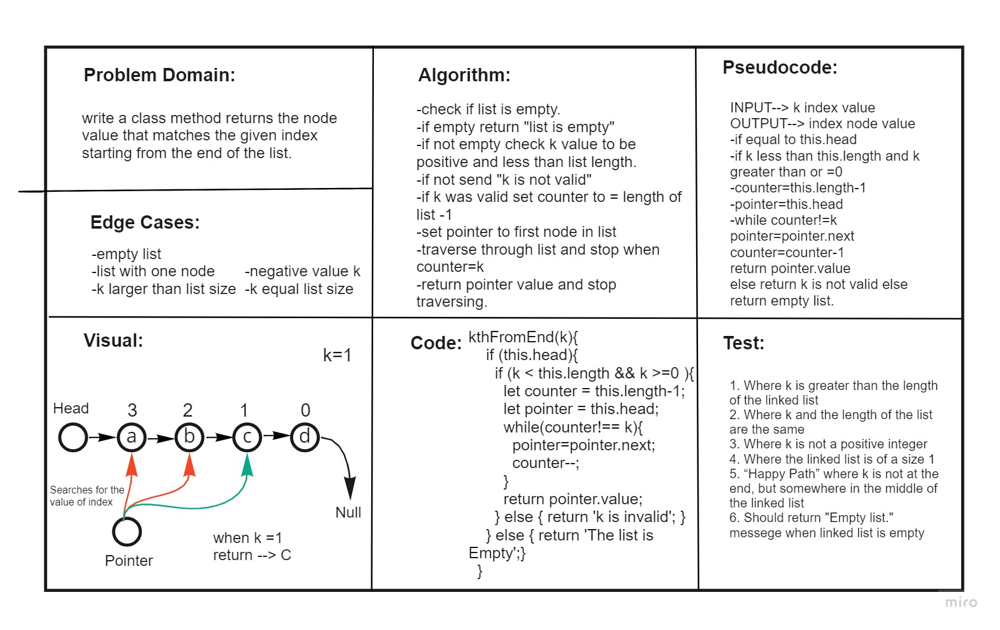
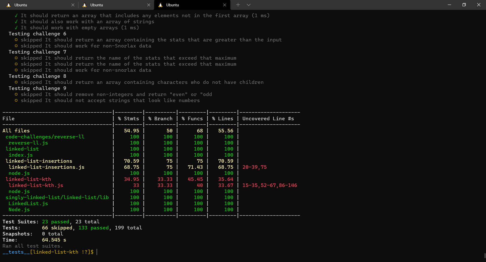

# Linked List kth
<!-- Short summary or background information -->
A Linked List is a sequence of Nodes that are connected/linked to each other. The most defining feature of a Linked List is that each Node references the next Node in the link.
## Challenge
<!-- Description of the challenge -->
Write the following methods for the Linked List class:

Write the following method for the Linked List class:

### kth from end
- argument: a number, k, as a parameter.
- Return the node’s value that is k places from the tail of the linked list.
- You have access to the Node class and all the properties on the Linked List class as well as the methods created in previous challenges.

## add tests to the code to test for the following:
 
### 1. Where k is greater than the length of the linked list
### 2. Where k and the length of the list are the same
### 3. Where k is not a positive integer
### 4. Where the linked list is of a size 1
### 5. “Happy Path” where k is not at the end, but somewhere in the middle of the linked list
### 6. Should return "Empty list." messege when linked list is empty

## Approach & Efficiency
<!-- What approach did you take? Why? What is the Big O space/time for this approach? -->

* ### Analyzed the problem
* ### Thought about the algorithm 
* ### Wrote the coding depending on today's demo
* ### I created the node test as well as LinkedList test
## API
<!-- Description of each method publicly available to your Linked List -->

* ### Insert(): which takes value of type any adding new node with the input value to the list.

* ### include(): this method compare input value if it's exist in linked list.

* ### toString(): return a string visiulizing the linked list shape.

* ### append(): appends an new node with given value to the end of the list.

* ### insertBefore(): adds a new node with give value before specified value node.

* ### insertAfter(): adds a new node with give value after specified value node.

* ### kthFromEnd(): finds the node value to certain index from the end of list.

## Test
### npm run test 

