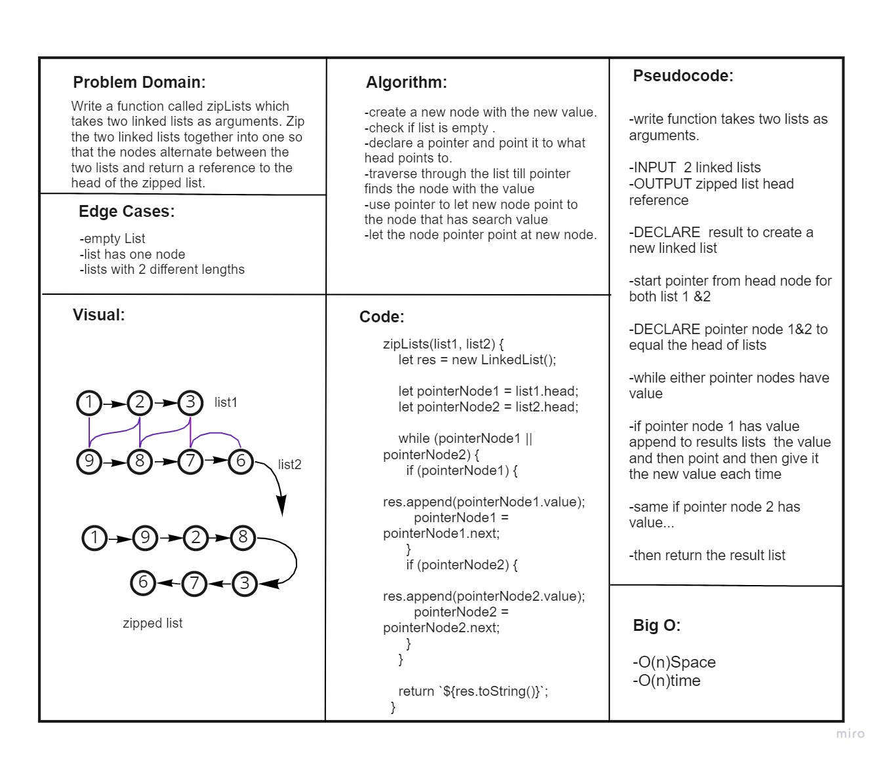
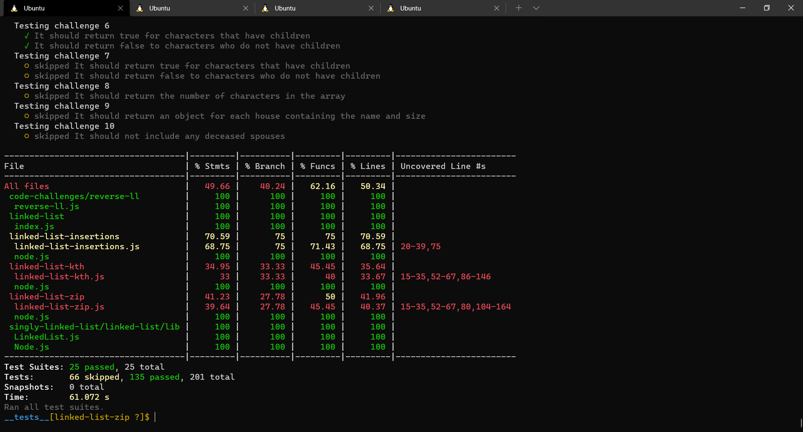

# Linked List zip
<!-- Short summary or background information -->
A Linked List is a sequence of Nodes that are connected/linked to each other. The most defining feature of a Linked List is that each Node references the next Node in the link.
## Challenge
<!-- Description of the challenge -->
Write the following methods for the Linked List class:

### zip lists
Write a function called zipLists which takes two linked lists as arguments. Zip the two linked lists together into one so that the nodes alternate between the two lists and return a reference to the head of the zipped list. Try and keep additional space down to O(1). You have access to the Node class and all the properties on the Linked List class as well as the methods created in previous challenges

## add tests to the code to test for the following:
 
### 1.“Happy Path” - Expected outcome
### 2.Expected failure
### 3.Edge Case (if applicable/obvious)

## Approach & Efficiency
<!-- What approach did you take? Why? What is the Big O space/time for this approach? -->

* ### Analyzed the problem
* ### Thought about the algorithm 
* ### Wrote the coding depending on today's demo
* ### I created the node test as well as LinkedList test
## API
<!-- Description of each method publicly available to your Linked List -->

* ### Insert(): which takes value of type any adding new node with the input value to the list.

* ### include(): this method compare input value if it's exist in linked list.

* ### toString(): return a string visiulizing the linked list shape.

* ### append(): appends an new node with given value to the end of the list.

* ### insertBefore(): adds a new node with give value before specified value node.

* ### insertAfter(): adds a new node with give value after specified value node.

* ### kthFromEnd(): finds the node value to certain index from the end of list.

* ### zipLists(): Zip the two linked lists together into one so that the nodes alternate between the two lists and return a reference to the head of the zipped list.

## Test
### npm run test 

