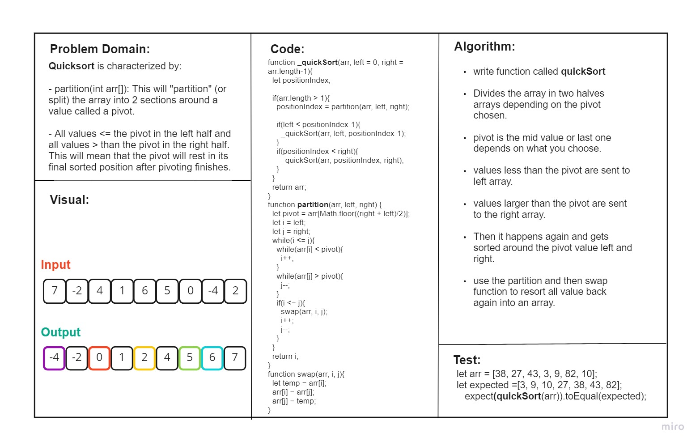
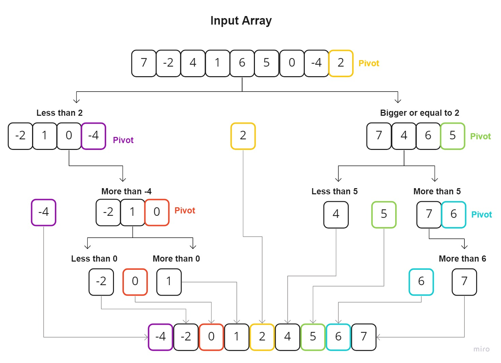
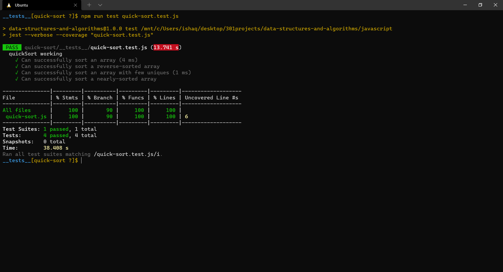

# Quick Sort
## Challenge Setup & Execution
### Branch Name: quick-sort

Quicksort is characterized by 2 major subroutines:

- split(T[] arr): This splits the array into two halves (often roughly halves) around a value called a pivot. The partition subroutine will return this "pivot" value and split(T[] arr) will be called on the left and right halves.

- partition(int arr[]): This will "partition" (or split) the array into 2 sections around a value called a pivot. All values <= the pivot in the left half and all values > than the pivot in the right half. This will mean that the pivot will rest in its final sorted position after pivoting finishes.

### Sample Arrays
In your blog article, visually show the output of processing this input array:

[8,4,23,42,16,15]

For your own understanding, consider also stepping through these inputs:

Reverse-sorted: [20,18,12,8,5,-2]
Few uniques: [5,12,7,5,5,7]
Nearly-sorted: [2,3,5,7,13,11]

## Write tests to prove the following functionality:

“Happy Path” - Expected outcome
Expected failure
Edge Case (if applicable/obvious)l

## Approach & Efficiency
<!-- What approach did you take? Why? What is the Big O space/time for this approach? -->

* ### Analyzed the problem
* ### Thought about the algorithm 
* ### Wrote the coding depending on today's demo
* ### I created the node test as well as LinkedList test

## Test
### npm run test 

