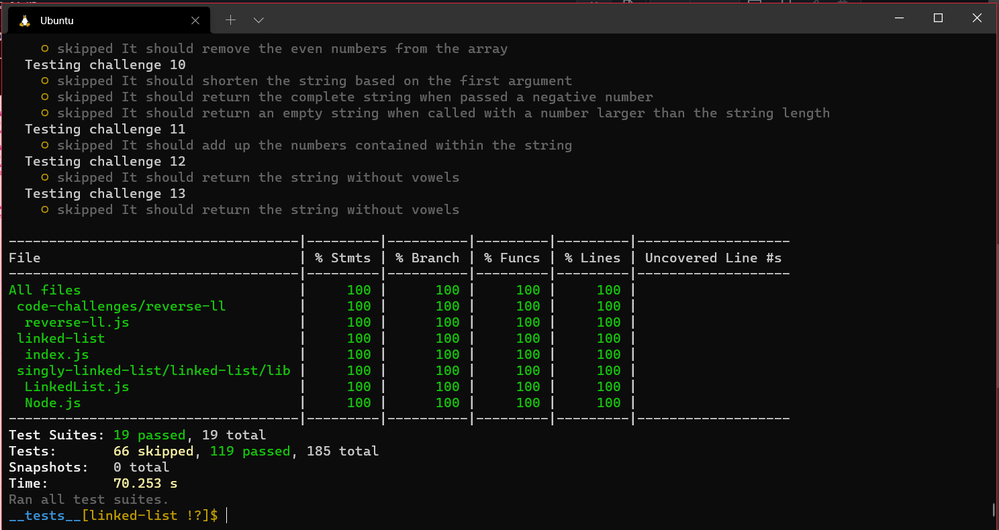

# Singly Linked List
<!-- Short summary or background information -->
A Linked List is a sequence of Nodes that are connected/linked to each other. The most defining feature of a Linked List is that each Node references the next Node in the link.
## Challenge
<!-- Description of the challenge -->
### Node
Create a Node class that has properties for the value stored in the Node, and a pointer to the next Node.
### Linked List
Create a Linked List class
Within your Linked List class, include a head property.
Upon instantiation, an empty Linked List should be created.
The class should contain the following methods
### insert
Arguments: value
Returns: nothing
Adds a new node with that value to the head of the list with an O(1) Time performance.
### includes
Arguments: value
Returns: Boolean
Indicates whether that value exists as a Node’s value somewhere within the list.
### to string
Arguments: none
Returns: a string representing all the values in the Linked List, formatted as:
"{ a } -> { b } -> { c } -> NULL"

## add tests to the code to test for the following:
### 1. Can successfully instantiate an empty linked list
### 2. Can properly insert into the linked list
### 3. The head property will properly point to the first node in the linked list
### 4. Can properly insert multiple nodes into the linked list
### 5. Will return true when finding a value within the linked list that exists
### 6. Will return false when searching for a value in the linked list that does not exist
### 7. Can properly return a collection of all the values that exist in the linked list 

## Approach & Efficiency
<!-- What approach did you take? Why? What is the Big O space/time for this approach? -->

* ### Analyzed the problem
* ### Thought about the algorithm 
* ### Wrote the coding depending on today's demo
* ### I created the node test as well as LinkedList test
## API
<!-- Description of each method publicly available to your Linked List -->
* ### Insert(): which takes value of type any adding new node with the input value to the list.

* ### include(): this method compare input value if it's exist in linked list.

* ### toString(): return a string visiulizing the linked list shape.

## Test
### npm run test 
