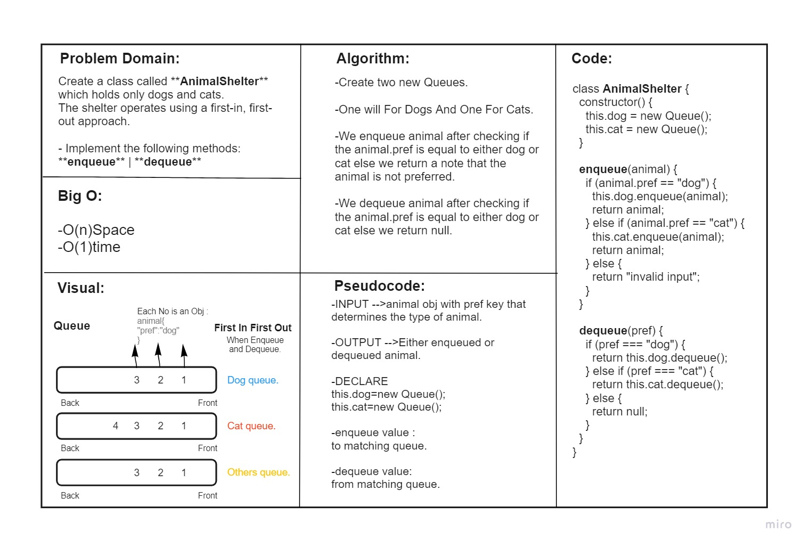
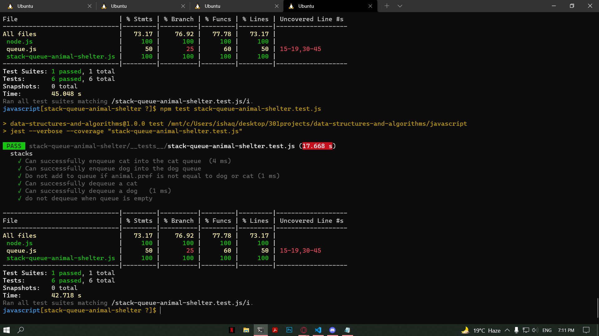

# Stack and Queue Pseudo
<!-- Short summary or background information -->
Create a class called **AnimalShelter** which holds only dogs and cats.
The shelter operates using a first-in, first-out approach.

- Implement the following methods:
**enqueue**
Arguments: animal
animal can be either a dog or a cat object.
**dequeue**
Arguments: pref
pref can be either "dog" or "cat"
Return: either a dog or a cat, based on preference.
If pref is not "dog" or "cat" then return null.
## Challenge
<!-- Description of the challenge -->
Using a Linked List as the underlying data storage mechanism, implement both a Stack and a Queue

### Node
Create a Node class that has properties for the value stored in the Node, and a pointer to the next node.
### Stack
Create a Stack class that has a top property. It creates an empty Stack when instantiated.
This object should be aware of a default empty value assigned to top when the stack is created.
The class should contain the following methods:

**push**
Arguments: value
adds a new node with that value to the top of the stack with an O(1) Time performance.

**pop**
Arguments: none
Returns: the value from node from the top of the stack
Removes the node from the top of the stack
Should raise exception when called on empty stack

**peek**
Arguments: none
Returns: Value of the node located at the top of the stack
Should raise exception when called on empty stack
is empty
Arguments: none
Returns: Boolean indicating whether or not the stack is empty.

### Queue
Create a Queue class that has a front property. It creates an empty Queue when instantiated.
This object should be aware of a default empty value assigned to front when the queue is created.
The class should contain the following methods:

**enqueue**
Arguments: value
adds a new node with that value to the back of the queue with an O(1) Time performance.

**dequeue**
Arguments: none
Returns: the value from node from the front of the queue
Removes the node from the front of the queue
Should raise exception when called on empty queue

**peek**
Arguments: none
Returns: Value of the node located at the front of the queue
Should raise exception when called on empty stack
is empty
Arguments: none
Returns: Boolean indicating whether or not the queue is empty

## Approach & Efficiency
<!-- What approach did you take? Why? What is the Big O space/time for this approach? -->

* ### Analyzed the problem
* ### Thought about the algorithm 
* ### Wrote the coding depending on today's demo
* ### I created the node test as well as LinkedList test

## API
<!-- Description of each method publicly available to your Linked List -->
**push**
adds a new node with that value to the top of the stack with an O(1) Time performance.

**pop**
Removes the node from the top of the stack

**peek**
Value of the node located at the top of the stack

**enqueue**
adds a new node with that value to the back of the queue with an O(1) Time performance.

**dequeue**
Removes the node from the front of the queue

**peek**
Returns: Value of the node located at the front of the queue

## Test
### npm run test 

