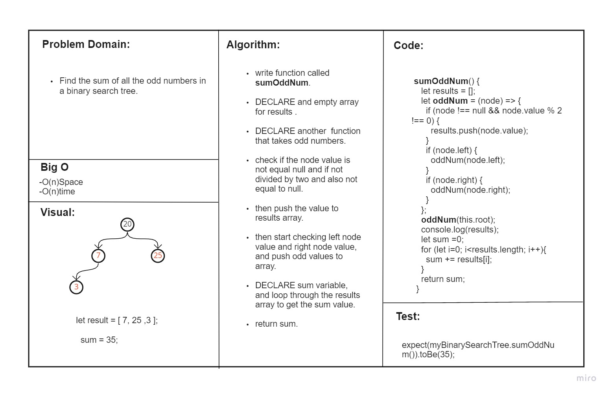
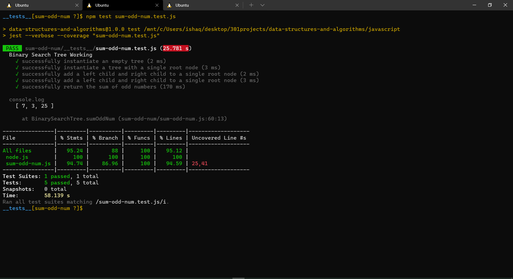

# sum-odd-num
<!-- Short summary or background information -->
## Challenge Setup & Execution
### Branch Name: sum-odd-num

## Features

### Node
Create a Node class that has properties for the value stored in the node, the left child node, and the right child node.

### sum-odd-num

Find the sum of all the odd numbers in a binary search tree. 

### breadth first
Write a function called breadth first
Arguments: tree
Return: list of all values in the tree, in the order they were encountered

## Approach & Efficiency
<!-- What approach did you take? Why? What is the Big O space/time for this approach? -->

* ### Analyzed the problem
* ### Thought about the algorithm 
* ### Wrote the coding depending on today's demo
* ### I created the node test as well as LinkedList test

## API
<!-- Description of each method publicly available to your Linked List -->
Write a function called fizz buzz tree
Arguments: k-ary tree
Return: new k-ary tree
Determine whether or not the value of each node is divisible by 3, 5 or both.

## Test
### npm run test 

