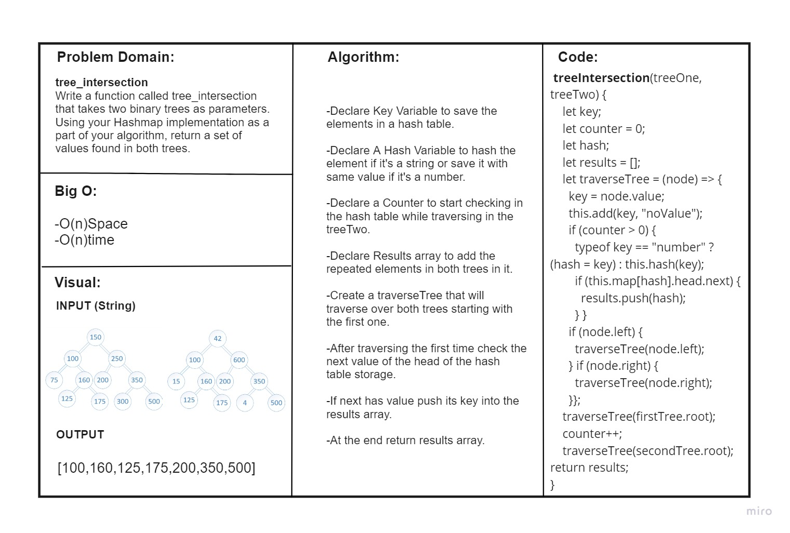
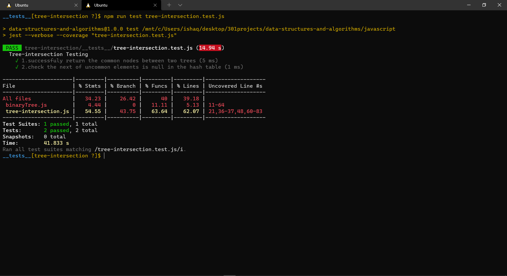

# Challenge Setup & Execution
## Branch Name: tree-intersection

### Challenge Type: tree_intersection

Write a function called tree_intersection that takes two binary trees as parameters.
Using your Hashmap implementation as a part of your algorithm, return a set of values found in both trees.

## Features
Implement a Hashtable Class with the following methods:

- **add**
Arguments: key, value
Returns: nothing
This method should hash the key, and add the key and value pair to the table, handling collisions as needed.
- **get**
Arguments: key
Returns: Value associated with that key in the table

- **contains**
Arguments: key
Returns: Boolean, indicating if the key exists in the table already.

- **hash**
Arguments: key
Returns: Index in the collection for that key

- **repeatedWord**
Write a function called repeated word that finds the first word to occur more than once in a string,Arguments string and Return string.

- **tree_intersection**
Write a function called tree_intersection that takes two binary trees as parameters.
Using your Hashmap implementation as a part of your algorithm, return a set of values found in both trees.

### Whiteboard

### Tests
