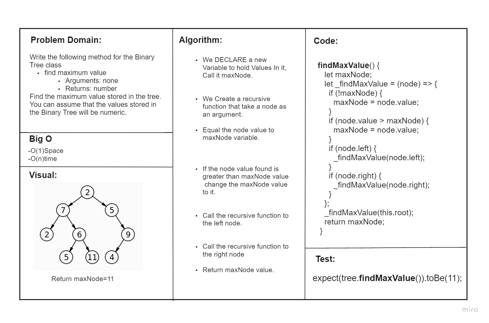
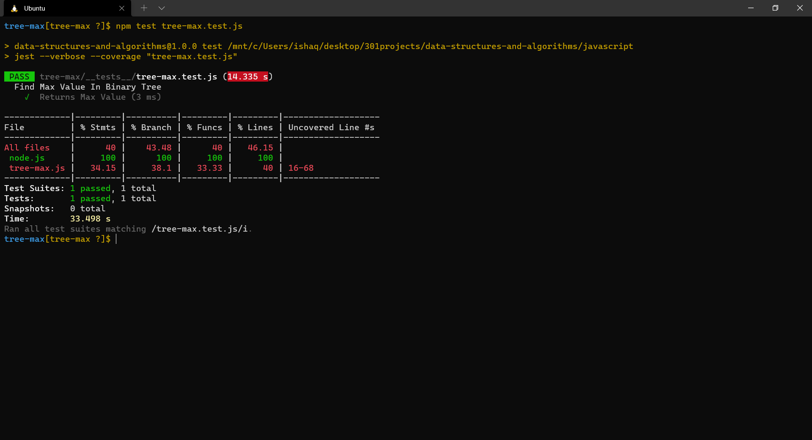

# Max-Tree
<!-- Short summary or background information -->
## Challenge Setup & Execution
### Branch Name: max-tree

## Features

### Node
Create a Node class that has properties for the value stored in the node, the left child node, and the right child node.

### Binary Tree

Create a Binary Tree class
Define a method for each of the depth first traversals:

- pre order
- in order
- post order 

which returns an array of the values, ordered appropriately.
Any exceptions or errors that come from your code should be semantic, capture-able errors. For example, rather than a default error thrown by your language, your code should raise/throw a custom, semantic error that describes what went wrong in calling the methods you wrote for this lab.

 ### Binary Search Tree

Create a Binary Search Tree class
This class should be a sub-class (or your languages equivalent) of the Binary Tree Class, with the following additional methods:
Add
Arguments: value
Return: nothing
Adds a new node with that value in the correct location in the binary search tree.
Contains
Argument: value
Returns: boolean indicating whether or not the value is in the tree at least once.
Structure and Testing
Utilize the Single-responsibility principle: any methods you write should be clean, reusable, abstract component parts to the whole challenge. You will be given feedback and marked down if you attempt to define a large, complex algorithm in one function definition.

## Write tests to prove the following functionality:

- Can successfully instantiate an empty tree
- Can successfully instantiate a tree with a single root node
- Can successfully add a left child and right child to a single root node
- Can successfully return a collection from a preorder traversal
- Can successfully return a collection from an inorder traversal
- Can successfully return a collection from a postorder traversal

## Approach & Efficiency
<!-- What approach did you take? Why? What is the Big O space/time for this approach? -->

* ### Analyzed the problem
* ### Thought about the algorithm 
* ### Wrote the coding depending on today's demo
* ### I created the node test as well as LinkedList test

## API
<!-- Description of each method publicly available to your Linked List -->
Write the following method for the Binary Tree class

find maximum value
Arguments: none
Returns: number
Find the maximum value stored in the tree. You can assume that the values stored in the Binary Tree will be numeric.

## Test
### npm run test 

